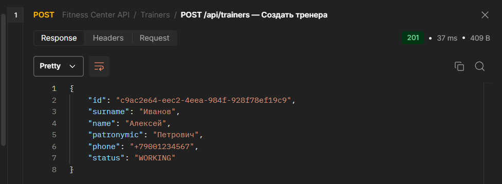
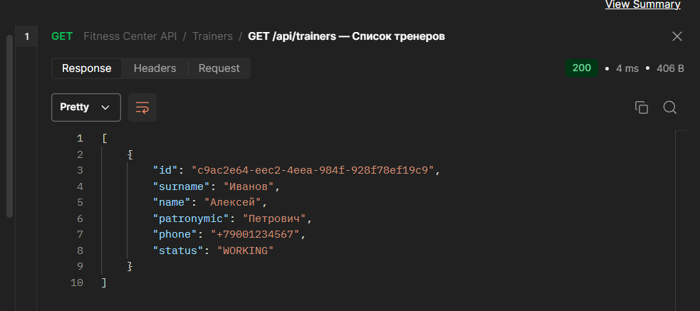
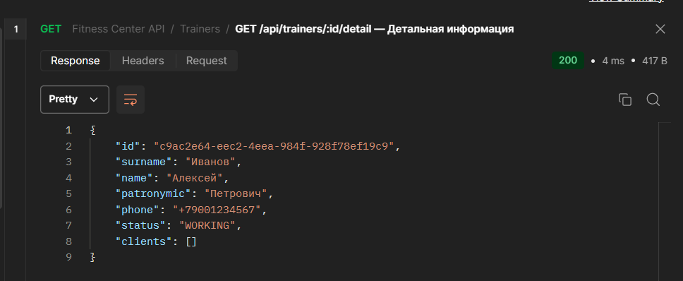
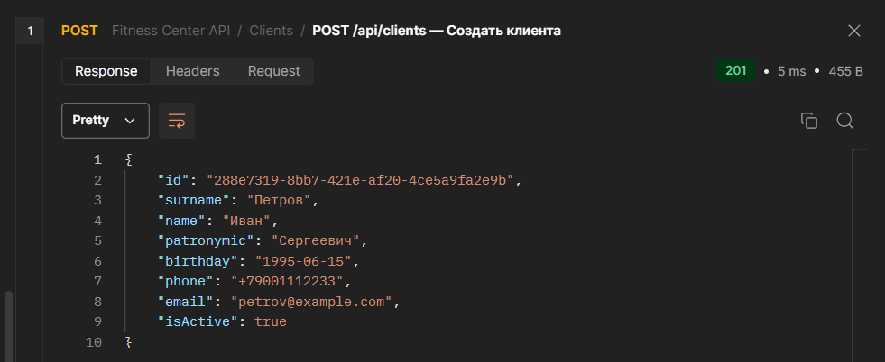
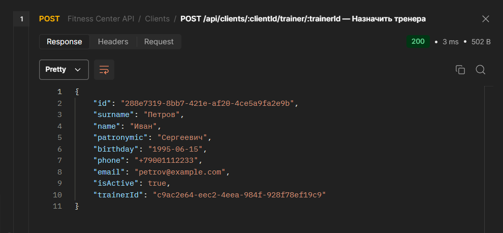
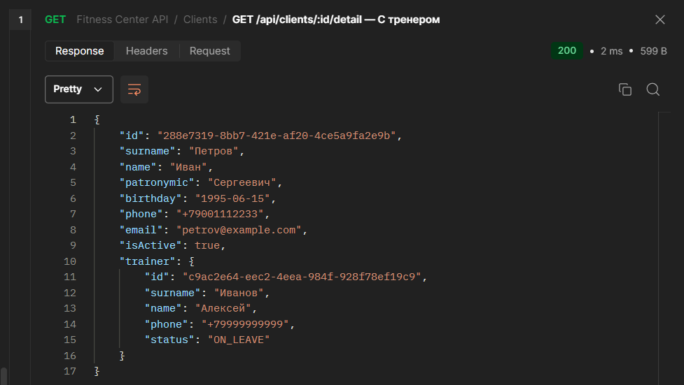
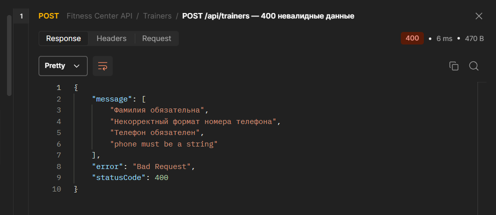

# Fitness Center REST API — Часть 1

REST API системы управления фитнес-центром. Данные хранятся в памяти процесса (in-memory, Map). База данных подключается во второй части.


## Ветка для первой части

```bash
git checkout part-1
```

---

## 1. Выбор технологий

| Технология | Версия | Назначение |
|---|---|---|
| Node.js | 20+ | Среда выполнения |
| TypeScript | 5+ | Язык разработки |
| NestJS | 10+ | Фреймворк для REST API |
| class-validator | 0.14+ | Валидация входных данных |
| class-transformer | 0.5+ | Преобразование типов (DTO → класс) |

**Почему NestJS** — модульная архитектура из коробки, встроенная поддержка валидации через `ValidationPipe`, удобное разделение на слои (Controller → Service → Repository).

**Почему Map вместо Array** — поиск по `id` через `map.get(id)` работает за O(1), тогда как `array.find()` — O(n).

---

## 2. Шаги по реализации

### 2.1. Инициализация проекта

```bash
nest new fitness-center-api
cd fitness-center-api
npm install class-validator class-transformer
```

### 2.2. Настройка ValidationPipe в `main.ts`

```ts
app.useGlobalPipes(
  new ValidationPipe({
    whitelist: true,
    forbidNonWhitelisted: true,
    transform: true,
  }),
);
```

### 2.3. Структура проекта

```
src/
├── clients/
│   ├── dto/
│   │   ├── create-client.dto.ts
│   │   ├── update-client.dto.ts
│   │   └── update-client-status.dto.ts
│   ├── clients.controller.ts
│   ├── clients.service.ts
│   ├── clients.repository.ts
│   └── clients.module.ts
├── trainers/
│   ├── dto/
│   │   ├── create-trainer.dto.ts
│   │   ├── update-trainer.dto.ts
│   │   └── update-trainer-status.dto.ts
│   ├── trainers.controller.ts
│   ├── trainers.service.ts
│   ├── trainers.repository.ts
│   └── trainers.module.ts
├── types/
│   ├── client.type.ts
│   └── trainer.type.ts
└── main.ts
```

### 2.4. Архитектура слоёв

```
Controller  →  принимает HTTP-запрос, вызывает сервис, возвращает ответ
Service     →  бизнес-логика (проверка существования, связи между сущностями)
Repository  →  CRUD-операции с хранилищем (in-memory Map)
```

Такое разделение позволяет заменить `Repository` на реальную БД во второй части без изменения `Controller` и `Service`.

### 2.5. Генерация модулей

```bash
nest generate resource trainers
nest generate resource clients
```

### 2.6. Запуск в режиме разработки

```bash
npm run start:dev
```

Сервер запускается на `http://localhost:3000` с автоматической перезагрузкой при изменении файлов.

---

## 3. REST API — эндпоинты

Базовый путь: `/api/`

### Тренеры (`/api/trainers`)

| Метод | Путь | Описание | Статус |
|---|---|---|---|
| POST | /api/trainers | Создать тренера | 201 |
| GET | /api/trainers | Список всех тренеров | 200 |
| GET | /api/trainers/:id/detail | Тренер + список его клиентов | 200 |
| PUT | /api/trainers/:id | Обновить данные тренера | 200 |
| PATCH | /api/trainers/:id/status | Изменить статус тренера | 200 |

### Клиенты (`/api/clients`)

| Метод | Путь | Описание | Статус |
|---|---|---|---|
| POST | /api/clients | Создать клиента | 201 |
| GET | /api/clients | Список всех клиентов | 200 |
| GET | /api/clients/:id | Краткая информация о клиенте | 200 |
| GET | /api/clients/:id/detail | Клиент + вложенный объект тренера | 200 |
| PUT | /api/clients/:id | Обновить данные клиента | 200 |
| PATCH | /api/clients/:id/status | Активировать / деактивировать | 200 |
| POST | /api/clients/:clientId/trainer/:trainerId | Назначить тренера клиенту | 200 |

---

## 4. Демонстрация результата


### Создание тренера (POST /api/trainers)


### Список тренеров (GET /api/trainers)


### Детальная информация о тренере (GET /api/trainers/:id/detail)


### Создание клиента (POST /api/clients)


### Назначение тренера клиенту (POST /api/clients/:clientId/trainer/:trainerId)


### Детальная информация о клиенте с тренером (GET /api/clients/:id/detail)


### Валидация — ошибка 400
